# 數據庫表結構文檔

本文檔詳細介紹 ETC 點雲標注系統的數據庫表結構設計，包括字段定義、關係映射、索引策略和業務約束。

## 數據庫概覽

### 設計原則
- **多專案架構**：支援多個獨立專案的數據隔離
- **UUID主鍵**：使用UUID確保全局唯一性和安全性
- **時間戳追蹤**：所有表都包含創建和更新時間
- **軟刪除設計**：重要數據支援軟刪除（標記為非活躍）
- **關係完整性**：完整的外鍵約束和級聯操作

### 表格分類
1. **用戶認證表**：用戶基本信息和認證
2. **專案管理表**：專案、成員、權限管理
3. **車型分類表**：全局和專案特定的車型定義
4. **數據文件表**：點雲文件管理
5. **任務流程表**：任務分配和執行
6. **標注業務表**：標注和審核流程
7. **系統功能表**：通知和日誌

## 詳細表結構

### 1. 用戶認證表 (users)

```sql
CREATE TABLE users (
    -- 主鍵和時間戳
    id UUID PRIMARY KEY DEFAULT uuid_generate_v4(),
    created_at TIMESTAMP NOT NULL DEFAULT CURRENT_TIMESTAMP,
    updated_at TIMESTAMP NOT NULL DEFAULT CURRENT_TIMESTAMP,
    
    -- 基本信息
    email VARCHAR(255) UNIQUE NOT NULL,
    full_name VARCHAR(100) NOT NULL,
    username VARCHAR(50) UNIQUE,
    
    -- 認證信息
    hashed_password VARCHAR(255) NOT NULL,
    is_active BOOLEAN NOT NULL DEFAULT TRUE,
    is_verified BOOLEAN NOT NULL DEFAULT FALSE,
    
    -- 角色權限
    global_role globalrole NOT NULL DEFAULT 'USER',
    
    -- 個人資料
    bio TEXT,
    avatar_url VARCHAR(500),
    phone VARCHAR(20),
    
    -- 活動追蹤
    last_login TIMESTAMP,
    last_active TIMESTAMP,
    email_verified_at TIMESTAMP,
    
    -- 帳戶狀態
    is_suspended BOOLEAN NOT NULL DEFAULT FALSE,
    suspended_at TIMESTAMP,
    suspended_reason TEXT
);

-- 索引
CREATE INDEX ix_users_email ON users(email);
CREATE INDEX ix_users_username ON users(username);
```

**字段說明**：
- `global_role`：全局角色（SYSTEM_ADMIN, ADMIN, USER）
- `is_verified`：郵箱驗證狀態
- `is_suspended`：帳戶是否被暫停

**業務約束**：
- 郵箱和用戶名必須唯一
- 密碼使用bcrypt哈希存儲
- 軟刪除通過`is_active`標記

### 2. 專案表 (projects)

```sql
CREATE TABLE projects (
    -- 繼承BaseUUIDModel
    id UUID PRIMARY KEY DEFAULT uuid_generate_v4(),
    created_at TIMESTAMP NOT NULL DEFAULT CURRENT_TIMESTAMP,
    updated_at TIMESTAMP NOT NULL DEFAULT CURRENT_TIMESTAMP,
    
    -- 基本信息
    name VARCHAR(200) NOT NULL,
    description TEXT,
    
    -- 狀態管理
    status projectstatus NOT NULL DEFAULT 'ACTIVE',
    is_active BOOLEAN NOT NULL DEFAULT TRUE,
    is_public BOOLEAN NOT NULL DEFAULT FALSE,
    
    -- 創建者
    created_by UUID NOT NULL REFERENCES users(id),
    
    -- 統計信息
    total_tasks INTEGER NOT NULL DEFAULT 0,
    completed_tasks INTEGER NOT NULL DEFAULT 0,
    total_annotations INTEGER NOT NULL DEFAULT 0,
    
    -- 時間規劃
    start_date TIMESTAMP,
    end_date TIMESTAMP,
    
    -- 配置選項
    max_annotations_per_task INTEGER NOT NULL DEFAULT 3,
    auto_assign_tasks BOOLEAN NOT NULL DEFAULT TRUE,
    require_review BOOLEAN NOT NULL DEFAULT TRUE
);

-- 索引
CREATE INDEX ix_projects_name ON projects(name);
CREATE INDEX ix_projects_status ON projects(status);
```

**字段說明**：
- `status`：專案狀態（ACTIVE, PAUSED, COMPLETED, ARCHIVED）
- `max_annotations_per_task`：每個任務的最大標注數
- `require_review`：是否需要審核流程

### 3. 專案成員表 (project_members)

```sql
CREATE TABLE project_members (
    -- 繼承BaseUUIDModel
    id UUID PRIMARY KEY DEFAULT uuid_generate_v4(),
    created_at TIMESTAMP NOT NULL DEFAULT CURRENT_TIMESTAMP,
    updated_at TIMESTAMP NOT NULL DEFAULT CURRENT_TIMESTAMP,
    
    -- 核心關聯
    project_id UUID NOT NULL REFERENCES projects(id),
    user_id UUID NOT NULL REFERENCES users(id),
    
    -- 角色和狀態
    role projectrole NOT NULL,
    is_active BOOLEAN NOT NULL DEFAULT TRUE,
    
    -- 成員時間
    joined_at TIMESTAMP NOT NULL DEFAULT CURRENT_TIMESTAMP,
    left_at TIMESTAMP,
    
    -- 邀請信息
    invited_by UUID REFERENCES users(id),
    invitation_accepted_at TIMESTAMP,
    
    -- 績效統計
    tasks_assigned INTEGER NOT NULL DEFAULT 0,
    tasks_completed INTEGER NOT NULL DEFAULT 0,
    annotations_created INTEGER NOT NULL DEFAULT 0,
    
    -- 唯一約束
    CONSTRAINT uq_project_member UNIQUE(project_id, user_id)
);

-- 索引
CREATE INDEX ix_project_members_project_id ON project_members(project_id);
CREATE INDEX ix_project_members_user_id ON project_members(user_id);
```

**字段說明**：
- `role`：專案角色（PROJECT_ADMIN, ANNOTATOR, REVIEWER, VIEWER）
- `tasks_assigned/completed`：任務統計
- 唯一約束確保用戶在專案中只有一個成員記錄

### 4. 全局車型表 (global_vehicle_types)

```sql
CREATE TABLE global_vehicle_types (
    -- 繼承BaseUUIDModel
    id UUID PRIMARY KEY DEFAULT uuid_generate_v4(),
    created_at TIMESTAMP NOT NULL DEFAULT CURRENT_TIMESTAMP,
    updated_at TIMESTAMP NOT NULL DEFAULT CURRENT_TIMESTAMP,
    
    -- 基本信息
    name VARCHAR(100) UNIQUE NOT NULL,
    display_name VARCHAR(150) NOT NULL,
    description TEXT,
    
    -- 分類信息
    category VARCHAR(50), -- e.g., "car", "truck", "motorcycle"
    
    -- 顯示配置
    sort_order INTEGER NOT NULL DEFAULT 0,
    color VARCHAR(7), -- Hex color code
    
    -- 狀態管理
    is_active BOOLEAN NOT NULL DEFAULT TRUE,
    is_system BOOLEAN NOT NULL DEFAULT FALSE,
    
    -- 使用統計
    usage_count INTEGER NOT NULL DEFAULT 0
);

-- 索引
CREATE INDEX ix_global_vehicle_types_name ON global_vehicle_types(name);
```

**字段說明**：
- `is_system`：是否為系統預定義車型
- `usage_count`：被專案使用的次數
- `color`：UI顯示顏色（十六進制）

### 5. 專案車型表 (project_vehicle_types)

```sql
CREATE TABLE project_vehicle_types (
    -- 繼承BaseProjectModel
    id UUID PRIMARY KEY DEFAULT uuid_generate_v4(),
    created_at TIMESTAMP NOT NULL DEFAULT CURRENT_TIMESTAMP,
    updated_at TIMESTAMP NOT NULL DEFAULT CURRENT_TIMESTAMP,
    project_id UUID NOT NULL REFERENCES projects(id),
    
    -- 全局車型關聯
    global_type_id UUID REFERENCES global_vehicle_types(id),
    
    -- 基本信息
    name VARCHAR(100) NOT NULL,
    display_name VARCHAR(150) NOT NULL,
    description TEXT,
    
    -- 來源標記
    source vehicletypesource NOT NULL DEFAULT 'PROJECT',
    
    -- 分類和顯示
    category VARCHAR(50),
    sort_order INTEGER NOT NULL DEFAULT 0,
    color VARCHAR(7),
    is_active BOOLEAN NOT NULL DEFAULT TRUE,
    
    -- 使用統計
    usage_count INTEGER NOT NULL DEFAULT 0,
    
    -- 唯一約束
    CONSTRAINT uq_project_vehicle_type_name UNIQUE(project_id, name)
);

-- 索引
CREATE INDEX ix_project_vehicle_types_name ON project_vehicle_types(name);
CREATE INDEX ix_project_vehicle_types_project_id ON project_vehicle_types(project_id);
```

**字段說明**：
- `source`：車型來源（GLOBAL, PROJECT）
- `global_type_id`：關聯的全局車型（可為空）
- 唯一約束確保專案內車型名稱不重複

### 6. 點雲文件表 (pointcloud_files)

```sql
CREATE TABLE pointcloud_files (
    -- 繼承BaseProjectModel
    id UUID PRIMARY KEY DEFAULT uuid_generate_v4(),
    created_at TIMESTAMP NOT NULL DEFAULT CURRENT_TIMESTAMP,
    updated_at TIMESTAMP NOT NULL DEFAULT CURRENT_TIMESTAMP,
    project_id UUID NOT NULL REFERENCES projects(id),
    
    -- 文件基本信息
    filename VARCHAR(255) NOT NULL,
    original_filename VARCHAR(255) NOT NULL,
    file_path VARCHAR(500) NOT NULL,
    file_size BIGINT NOT NULL,
    
    -- 文件狀態
    status filestatus NOT NULL DEFAULT 'UPLOADING',
    
    -- 上傳信息
    uploaded_by UUID NOT NULL REFERENCES users(id),
    upload_completed_at TIMESTAMP,
    
    -- 文件元數據
    file_hash VARCHAR(64),
    content_type VARCHAR(100),
    
    -- 點雲數據統計
    point_count BIGINT,
    has_colors BOOLEAN NOT NULL DEFAULT FALSE,
    has_normals BOOLEAN NOT NULL DEFAULT FALSE,
    has_intensity BOOLEAN NOT NULL DEFAULT FALSE,
    
    -- 邊界框信息
    bbox_min_x DOUBLE PRECISION,
    bbox_min_y DOUBLE PRECISION,
    bbox_min_z DOUBLE PRECISION,
    bbox_max_x DOUBLE PRECISION,
    bbox_max_y DOUBLE PRECISION,
    bbox_max_z DOUBLE PRECISION,
    
    -- 品質評估
    has_outliers BOOLEAN NOT NULL DEFAULT FALSE,
    
    -- 額外元數據
    extra_data JSONB,
    
    -- 錯誤信息
    error_message TEXT,
    processing_log TEXT
);

-- 索引
CREATE INDEX ix_pointcloud_files_filename ON pointcloud_files(filename);
CREATE INDEX ix_pointcloud_files_project_id ON pointcloud_files(project_id);
CREATE INDEX ix_pointcloud_files_status ON pointcloud_files(status);
```

**字段說明**：
- `status`：文件狀態（UPLOADING, PROCESSING, READY, ERROR）
- `point_count`：點雲點數統計
- `bbox_*`：3D邊界框坐標
- `extra_data`：JSON格式的額外元數據

### 7. 任務表 (tasks)

```sql
CREATE TABLE tasks (
    -- 繼承BaseProjectModel
    id UUID PRIMARY KEY DEFAULT uuid_generate_v4(),
    created_at TIMESTAMP NOT NULL DEFAULT CURRENT_TIMESTAMP,
    updated_at TIMESTAMP NOT NULL DEFAULT CURRENT_TIMESTAMP,
    project_id UUID NOT NULL REFERENCES projects(id),
    
    -- 基本信息
    name VARCHAR(200) NOT NULL,
    description TEXT,
    instructions TEXT,
    
    -- 狀態和優先級
    status taskstatus NOT NULL DEFAULT 'PENDING',
    priority taskpriority NOT NULL DEFAULT 'MEDIUM',
    
    -- 分配信息
    assigned_to UUID REFERENCES users(id),
    assigned_at TIMESTAMP,
    created_by UUID NOT NULL REFERENCES users(id),
    
    -- 關聯文件
    pointcloud_file_id UUID NOT NULL REFERENCES pointcloud_files(id),
    
    -- 任務配置
    max_annotations INTEGER NOT NULL DEFAULT 3,
    require_review BOOLEAN NOT NULL DEFAULT TRUE,
    
    -- 時間管理
    due_date TIMESTAMP,
    completed_at TIMESTAMP,
    
    -- 品質控制
    quality_score INTEGER -- 1-10 scale
);

-- 索引
CREATE INDEX ix_tasks_assigned_to ON tasks(assigned_to);
CREATE INDEX ix_tasks_name ON tasks(name);
CREATE INDEX ix_tasks_project_id ON tasks(project_id);
CREATE INDEX ix_tasks_status ON tasks(status);
```

**字段說明**：
- `status`：任務狀態（PENDING, ASSIGNED, IN_PROGRESS, COMPLETED, REVIEWED, CANCELLED）
- `priority`：優先級（LOW, MEDIUM, HIGH, URGENT）
- `quality_score`：品質評分（1-10分）

### 8. 標注表 (annotations)

```sql
CREATE TABLE annotations (
    -- 繼承BaseProjectModel
    id UUID PRIMARY KEY DEFAULT uuid_generate_v4(),
    created_at TIMESTAMP NOT NULL DEFAULT CURRENT_TIMESTAMP,
    updated_at TIMESTAMP NOT NULL DEFAULT CURRENT_TIMESTAMP,
    project_id UUID NOT NULL REFERENCES projects(id),
    
    -- 關聯信息
    task_id UUID NOT NULL REFERENCES tasks(id),
    annotator_id UUID NOT NULL REFERENCES users(id),
    vehicle_type_id UUID NOT NULL REFERENCES project_vehicle_types(id),
    
    -- 標注內容
    vehicle_label VARCHAR(100) NOT NULL,
    confidence_score DOUBLE PRECISION,
    
    -- 狀態管理
    status annotationstatus NOT NULL DEFAULT 'DRAFT',
    
    -- 時間追蹤
    started_at TIMESTAMP,
    completed_at TIMESTAMP,
    
    -- 品質控制
    quality_score INTEGER,
    
    -- 額外數據
    extra_data JSONB,
    
    -- 版本控制
    version INTEGER NOT NULL DEFAULT 1,
    parent_annotation_id UUID REFERENCES annotations(id),
    
    -- 備註
    notes TEXT
);

-- 索引
CREATE INDEX ix_annotations_annotator_id ON annotations(annotator_id);
CREATE INDEX ix_annotations_project_id ON annotations(project_id);
CREATE INDEX ix_annotations_status ON annotations(status);
CREATE INDEX ix_annotations_task_id ON annotations(task_id);
```

**字段說明**：
- `status`：標注狀態（DRAFT, SUBMITTED, APPROVED, REJECTED, REVISION_REQUESTED）
- `confidence_score`：標注置信度（0.0-1.0）
- `parent_annotation_id`：修正版本的父標注

### 9. 標注審核表 (annotation_reviews)

```sql
CREATE TABLE annotation_reviews (
    -- 繼承BaseProjectModel
    id UUID PRIMARY KEY DEFAULT uuid_generate_v4(),
    created_at TIMESTAMP NOT NULL DEFAULT CURRENT_TIMESTAMP,
    updated_at TIMESTAMP NOT NULL DEFAULT CURRENT_TIMESTAMP,
    project_id UUID NOT NULL REFERENCES projects(id),
    
    -- 關聯信息
    annotation_id UUID NOT NULL REFERENCES annotations(id),
    reviewer_id UUID NOT NULL REFERENCES users(id),
    
    -- 審核結果
    status reviewstatus NOT NULL DEFAULT 'PENDING',
    decision VARCHAR(20) NOT NULL, -- 'approve', 'reject', 'request_revision'
    
    -- 評分和反饋
    quality_score INTEGER, -- 1-10 scale
    feedback TEXT,
    
    -- 時間追蹤
    reviewed_at TIMESTAMP,
    
    -- 審核標準
    criteria_met JSONB, -- 各項標準的評分
    
    -- 建議改進
    improvement_suggestions TEXT
);

-- 索引
CREATE INDEX ix_annotation_reviews_annotation_id ON annotation_reviews(annotation_id);
CREATE INDEX ix_annotation_reviews_project_id ON annotation_reviews(project_id);
CREATE INDEX ix_annotation_reviews_reviewer_id ON annotation_reviews(reviewer_id);
CREATE INDEX ix_annotation_reviews_status ON annotation_reviews(status);
```

**字段說明**：
- `decision`：審核決定（approve, reject, request_revision）
- `criteria_met`：JSON格式的詳細評分標準
- `improvement_suggestions`：改進建議

### 10. 通知表 (notifications)

```sql
CREATE TABLE notifications (
    -- 繼承BaseUUIDModel
    id UUID PRIMARY KEY DEFAULT uuid_generate_v4(),
    created_at TIMESTAMP NOT NULL DEFAULT CURRENT_TIMESTAMP,
    updated_at TIMESTAMP NOT NULL DEFAULT CURRENT_TIMESTAMP,
    
    -- 接收者
    user_id UUID NOT NULL REFERENCES users(id),
    
    -- 專案上下文（可選）
    project_id UUID REFERENCES projects(id),
    
    -- 通知類型
    type notificationtype NOT NULL,
    
    -- 內容
    title VARCHAR(200) NOT NULL,
    message TEXT NOT NULL,
    
    -- 狀態
    status notificationstatus NOT NULL DEFAULT 'UNREAD',
    read_at TIMESTAMP,
    
    -- 關聯實體
    related_task_id UUID REFERENCES tasks(id),
    related_annotation_id UUID REFERENCES annotations(id),
    
    -- 額外數據
    extra_data JSONB,
    
    -- 操作連結
    action_url VARCHAR(500)
);

-- 索引
CREATE INDEX ix_notifications_project_id ON notifications(project_id);
CREATE INDEX ix_notifications_status ON notifications(status);
CREATE INDEX ix_notifications_type ON notifications(type);
CREATE INDEX ix_notifications_user_id ON notifications(user_id);
```

**字段說明**：
- `type`：通知類型（TASK_ASSIGNED, TASK_COMPLETED, REVIEW_REQUESTED等）
- `status`：通知狀態（UNREAD, READ, ARCHIVED）
- `action_url`：相關操作的連結

## 枚舉類型定義

### 用戶角色 (GlobalRole)
```sql
CREATE TYPE globalrole AS ENUM (
    'SYSTEM_ADMIN',  -- 系統管理員
    'ADMIN',         -- 管理員
    'USER'           -- 一般用戶
);
```

### 專案角色 (ProjectRole)
```sql
CREATE TYPE projectrole AS ENUM (
    'PROJECT_ADMIN', -- 專案管理員
    'ANNOTATOR',     -- 標注員
    'REVIEWER',      -- 審核員
    'VIEWER'         -- 查看者
);
```

### 專案狀態 (ProjectStatus)
```sql
CREATE TYPE projectstatus AS ENUM (
    'ACTIVE',        -- 進行中
    'PAUSED',        -- 暫停
    'COMPLETED',     -- 已完成
    'ARCHIVED'       -- 已歸檔
);
```

### 任務狀態 (TaskStatus)
```sql
CREATE TYPE taskstatus AS ENUM (
    'PENDING',       -- 待分配
    'ASSIGNED',      -- 已分配
    'IN_PROGRESS',   -- 進行中
    'COMPLETED',     -- 已完成
    'REVIEWED',      -- 已審核
    'CANCELLED'      -- 已取消
);
```

### 其他枚舉類型
- `TaskPriority`: LOW, MEDIUM, HIGH, URGENT
- `AnnotationStatus`: DRAFT, SUBMITTED, APPROVED, REJECTED, REVISION_REQUESTED
- `ReviewStatus`: PENDING, COMPLETED, CANCELLED
- `FileStatus`: UPLOADING, PROCESSING, READY, ERROR
- `VehicleTypeSource`: GLOBAL, PROJECT
- `NotificationType`: TASK_ASSIGNED, TASK_COMPLETED, REVIEW_REQUESTED, REVIEW_COMPLETED, PROJECT_INVITATION, INFO, WARNING, ERROR
- `NotificationStatus`: UNREAD, READ, ARCHIVED

## 數據庫關係圖

以下是完整的數據庫實體關係圖，清楚展示所有表之間的關聯：

```mermaid
erDiagram
    %% 用戶認證表
    users {
        UUID id PK
        timestamp created_at
        timestamp updated_at
        string email UK
        string full_name
        string username UK
        string hashed_password
        boolean is_active
        boolean is_verified
        enum global_role
        string bio
        string avatar_url
        string phone
        timestamp last_login
        timestamp last_active
        timestamp email_verified_at
        boolean is_suspended
        timestamp suspended_at
        text suspended_reason
    }

    %% 專案管理表
    projects {
        UUID id PK
        timestamp created_at
        timestamp updated_at
        string name
        text description
        enum status
        boolean is_active
        boolean is_public
        UUID created_by FK
        integer total_tasks
        integer completed_tasks
        integer total_annotations
        timestamp start_date
        timestamp end_date
        integer max_annotations_per_task
        boolean auto_assign_tasks
        boolean require_review
    }

    %% 專案成員表
    project_members {
        UUID id PK
        timestamp created_at
        timestamp updated_at
        UUID project_id FK
        UUID user_id FK
        enum role
        boolean is_active
        timestamp joined_at
        timestamp left_at
        UUID invited_by FK
        timestamp invitation_accepted_at
        integer tasks_assigned
        integer tasks_completed
        integer annotations_created
    }

    %% 全局車型表
    global_vehicle_types {
        UUID id PK
        timestamp created_at
        timestamp updated_at
        string name UK
        string display_name
        text description
        string category
        integer sort_order
        string color
        boolean is_active
        boolean is_system
        integer usage_count
    }

    %% 專案車型表
    project_vehicle_types {
        UUID id PK
        timestamp created_at
        timestamp updated_at
        UUID project_id FK
        UUID global_type_id FK
        string name
        string display_name
        text description
        enum source
        string category
        integer sort_order
        string color
        boolean is_active
        integer usage_count
    }

    %% 點雲文件表
    pointcloud_files {
        UUID id PK
        timestamp created_at
        timestamp updated_at
        UUID project_id FK
        string filename
        string original_filename
        string file_path
        bigint file_size
        enum status
        UUID uploaded_by FK
        timestamp upload_completed_at
        string file_hash
        string content_type
        bigint point_count
        boolean has_colors
        boolean has_normals
        boolean has_intensity
        double bbox_min_x
        double bbox_min_y
        double bbox_min_z
        double bbox_max_x
        double bbox_max_y
        double bbox_max_z
        boolean has_outliers
        jsonb extra_data
        text error_message
        text processing_log
    }

    %% 任務表
    tasks {
        UUID id PK
        timestamp created_at
        timestamp updated_at
        UUID project_id FK
        string name
        text description
        text instructions
        enum status
        enum priority
        UUID assigned_to FK
        timestamp assigned_at
        UUID created_by FK
        UUID pointcloud_file_id FK
        integer max_annotations
        boolean require_review
        timestamp due_date
        timestamp completed_at
        integer quality_score
    }

    %% 標注表
    annotations {
        UUID id PK
        timestamp created_at
        timestamp updated_at
        UUID project_id FK
        UUID task_id FK
        UUID annotator_id FK
        UUID vehicle_type_id FK
        string vehicle_label
        double confidence_score
        enum status
        timestamp started_at
        timestamp completed_at
        integer quality_score
        jsonb extra_data
        integer version
        UUID parent_annotation_id FK
        text notes
    }

    %% 標注審核表
    annotation_reviews {
        UUID id PK
        timestamp created_at
        timestamp updated_at
        UUID project_id FK
        UUID annotation_id FK
        UUID reviewer_id FK
        enum status
        string decision
        integer quality_score
        text feedback
        timestamp reviewed_at
        jsonb criteria_met
        text improvement_suggestions
    }

    %% 通知表
    notifications {
        UUID id PK
        timestamp created_at
        timestamp updated_at
        UUID user_id FK
        UUID project_id FK
        enum type
        string title
        text message
        enum status
        timestamp read_at
        UUID related_task_id FK
        UUID related_annotation_id FK
        jsonb extra_data
        string action_url
    }

    %% 主要關係定義
    users ||--o{ projects : "creates"
    users ||--o{ project_members : "becomes_member"
    projects ||--o{ project_members : "has_members"
    projects ||--o{ project_vehicle_types : "defines_vehicle_types"
    projects ||--o{ pointcloud_files : "contains_files"
    projects ||--o{ tasks : "has_tasks"
    projects ||--o{ annotations : "has_annotations"
    projects ||--o{ annotation_reviews : "has_reviews"
    projects ||--o{ notifications : "sends_notifications"
    
    %% 車型關係
    global_vehicle_types ||--o{ project_vehicle_types : "extends_to"
    
    %% 用戶操作關係
    users ||--o{ pointcloud_files : "uploads"
    users ||--o{ tasks : "assigned_to"
    users ||--o{ tasks : "creates_tasks"
    users ||--o{ annotations : "annotates"
    users ||--o{ annotation_reviews : "reviews"
    users ||--o{ notifications : "receives"
    users ||--o{ project_members : "invites"
    
    %% 工作流程關係
    pointcloud_files ||--o{ tasks : "processed_in"
    tasks ||--o{ annotations : "contains_annotations"
    project_vehicle_types ||--o{ annotations : "used_in"
    annotations ||--o{ annotation_reviews : "reviewed_by"
    annotations ||--o{ annotations : "parent_child_relation"
    
    %% 通知關聯
    tasks ||--o{ notifications : "task_related"
    annotations ||--o{ notifications : "annotation_related"
```



**圖表說明**：
- **PK**: Primary Key (主鍵)
- **FK**: Foreign Key (外鍵)  
- **UK**: Unique Key (唯一鍵)
- **||--o{**: 一對多關係
- **}o--o{**: 多對多關係（通過中間表）

## 關係說明

### 主要關係
1. **用戶 ↔ 專案**：多對多關係，通過`project_members`表
2. **專案 → 任務**：一對多關係
3. **任務 → 標注**：一對多關係
4. **標注 → 審核**：一對多關係
5. **全局車型 → 專案車型**：一對多關係

### 級聯操作
- **刪除專案**：級聯刪除所有相關的任務、標注、成員等
- **刪除用戶**：保留其創建的內容，但清除分配關係
- **刪除車型**：檢查是否有關聯的標注，有則禁止刪除

## 索引策略

### 主要索引
- **查詢性能**：為常用查詢字段建立索引
- **唯一約束**：確保業務邏輯的完整性
- **外鍵索引**：自動為外鍵建立索引

### 複合索引（未來優化）
```sql
-- 專案成員查詢優化
CREATE INDEX ix_project_members_project_role ON project_members(project_id, role);

-- 任務狀態查詢優化
CREATE INDEX ix_tasks_project_status ON tasks(project_id, status);

-- 標注查詢優化
CREATE INDEX ix_annotations_task_status ON annotations(task_id, status);
```

## 數據完整性

### 約束規則
1. **外鍵約束**：確保關聯數據的存在
2. **唯一約束**：防止重複數據
3. **檢查約束**：確保數據值的有效性
4. **非空約束**：確保必要字段不為空

### 業務規則
1. **專案成員唯一性**：用戶在專案中只能有一個角色
2. **車型名稱唯一性**：專案內車型名稱不能重複
3. **任務分配邏輯**：只能分配給專案成員
4. **審核權限**：只有REVIEWER角色可以審核

這個數據庫設計支援：
- 🏢 **多專案架構**：完全的數據隔離
- 👥 **靈活的權限管理**：全局和專案級別的權限
- 🔄 **完整的工作流程**：從文件上傳到標注審核
- 📊 **豐富的統計功能**：支援各種報表需求
- 🔒 **數據安全**：完整的約束和驗證 